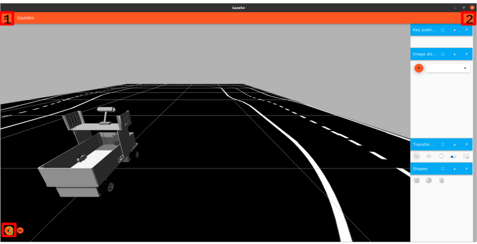
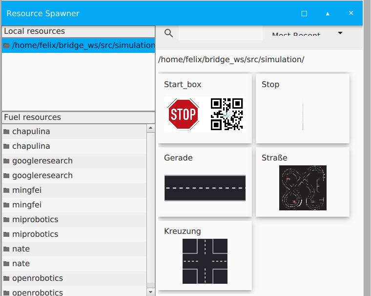

=== *Simlation*

Die Ingtion Simulationsumgebung bietet eine Menge verschiedener Optionen

Unter dem Allgemeinen Menü `1` können verscheiden Einstellungen zu der Ignition Umgebung gemacht werden. Hier kann auch eine Eingestellte Konfiguration gespeichert werden um diese später zu laden.

Unter dem Menü `2` können verschieden Reiter aufgerufen werden, welche rechts am Bildschirmrand erscheinen. Diese sind visuelle Tools von Umgebungsplugins die in der Simulation genutzt werden.
Die wichtigsten hierbei sind der:

`Entity Tree` mit dem die einzelnen Links und Joints aufgelsitet werden können

`Resource Spawner` mit dem verfügbare Ressourcen in der Simulation aufgerufen werden können. So lassen sich Beispielsweise Modelle in die Umgebung einfügen

`Transform Control`, mit diesem Plugin lassen sich bestehende Modelle in der Simulation verschieben und bewegen.

Bei `3` lässt sich die Simulation starten und Stoppen mit dem Play/Pause Knopf. Der Knopf daneben geht einen Simulationsschritt weiter.

==== Fahren

Wenn in einer Datei das KeyPublisher Plugin aktiv ist und eine Verwaltung für Input integriert, kann das Fahrzeug auch mit den Pfeilatsten gefahren werden. 
Bei den beiden Fahrzeugmodellen dieser Arbeit ist dies der Fall. Mit `.` kann hier ein Lenkwinkel von `0` eingestellt werden.

==== Elemente hinzufügen oder entfernen

Es lassen sich Modelle in eine laufende Simulation einbinden und wieder entfernen.

Zum Hinzufügen kann
====
ros2 run ros_ign_gazebo create
====
verwendet werden. Ein Beispiel hierfür ist 
====
ros2 run ros_ign_gazebo create -world 'car_world' -file ~/bridge_ws/src/simulation/start_box/start_box.sdf -allow_renaming true -Y 3.14 -z 0.09 -x 1.0 -y 0.4
====
Dabei wird die Start Box an der Position 1.0, 0.4, 0.09 in die Simulation eingefügt.

Weitere Optionen können mit 
====
ros run ros_ign_gazebo create --help 
====
aufgerufen werden.

Um ein Element zu entfernen muss der Name des Elements bekannt sein, so wie der name der `world` in der dieses Element eingebunden ist.
Dann kann es mit 
====
ign service -s /world/<world>/remove --reqtype ignition.msgs.Entity --reptype ignition.msgs.Boolean --timeout 300 --req \'name: \"<name>\" type: MODEL\'
====
über die Konsole entfernt werden. 
Alternativ kann es auch innerhalb der Ignition Simulation manuell entfert werden.
